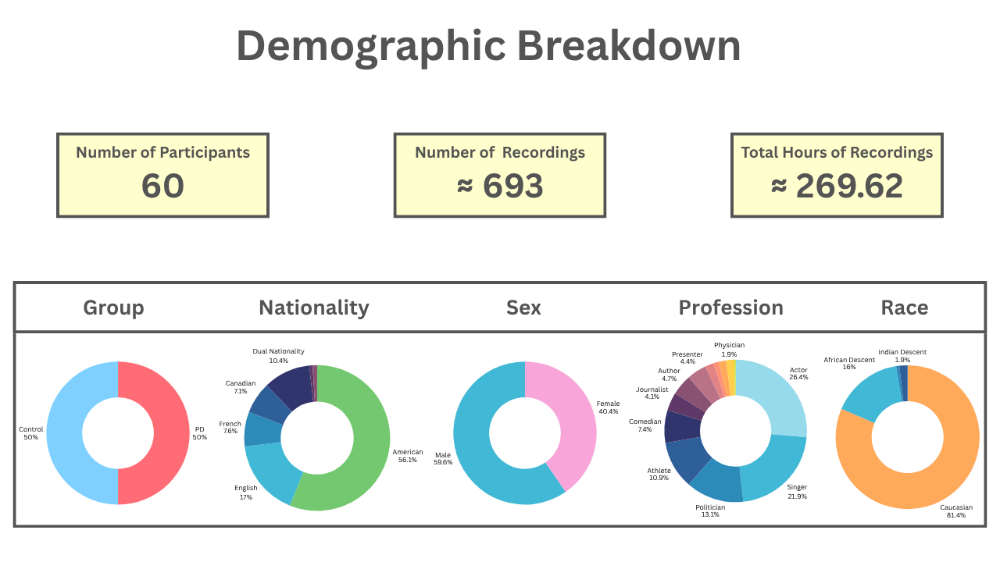

# Celebs4PD: A Longitudinal Corpus of Natural Celebrity Speech for Parkinson's Disease Detection

<table border="0" cellpadding="0" cellspacing="0" style="border: none;">
  <tr style="border: none;">
    <td style="border: none; vertical-align: middle; padding-right: 20px;">
      <strong>Celebs4PD</strong> is a curated corpus of celebrity speech designed for research on speech-based biomarkers of Parkinson's Disease (PD). The dataset provides natural, longitudinal recordings with demographic matching and standardized processing, enabling reproducible research in automatic PD detection and progression monitoring.
      <br><br>
        <span><strong>Languages:</strong></span>
      <span style="display: inline-block; background-color: #0366d6; color: white; padding: 4px 10px; border-radius: 3px; font-size: 12px; font-weight: 600; margin-right: 8px;">🇬🇧 English,</span>
      <span style="display: inline-block; background-color: #0366d6; color: white; padding: 4px 10px; border-radius: 3px; font-size: 12px; font-weight: 600;"> 🇫🇷 French</span>
    </td>
    <td style="border: none; vertical-align: middle;">
      
    </td>
  </tr>
</table>

---

## 📦 Access

The Celebs4PD metadata bundle is available through Zenodo under restricted access requiring a signed Data Use Agreement (DUA) for academic or non-commercial research purposes.

**Request access:** [doi.org/10.5281/zenodo.XXXXXXX](https://doi.org/10.5281/zenodo.XXXXXXX)

**Metadata bundle includes:**
- Subject-level demographics and diagnostic information
- Recording-level metadata (source URLs, dates, speaker IDs)
- Source mapping file for automated audio retrieval

**Generated locally via pipeline:**
- Audio files (obtained independently from public sources)
- Segment-level annotations with 40+ speech metrics

> ⚠️ **Data Availability Note:** The dataset was originally designed for 700 recordings across 60 participants. Of these, 692 recordings (98.9%) were successfully retrieved at the time of dataset creation. Eight recordings (1.1%) were unavailable due to content removal, account termination, geo-restrictions, or platform policy changes. The metadata structure reflects the original 700-recording design, but only successfully downloaded recordings have corresponding audio files. This is a typical challenge when working with publicly available web content, which remains subject to removal or access restrictions over time. Researchers should be aware that audio availability may change and that the provided metadata may reference recordings that are no longer accessible.

**Access procedure:**
1. Review and sign the Data Use Agreement on Zenodo
2. Submit signed DUA via email with subject line: **"Celebs4PD Data Use Agreement - [Your Name], [Your Institution]"** to nadine.el.mufti@gmail.com
3. Upon approval, receive access credentials for the metadata bundle

> **Processing pipeline and documentation available below** 👇

---

## 📊 Dataset Statistics

### Overview

The Celebs4PD dataset contains **60 participants** contributing **692 recordings** with a total duration of **270.25 hours** (~11.3 days) of audio data.

<p align="center">
  
</p>
  
### Comprehensive Dataset Breakdown

| Category | Subcategory | Participants | Recordings | Duration (hrs) | Avg Length (min) | % of Total |
|----------|-------------|--------------|------------|----------------|------------------|------------|
| **Overall** | **Total** | **60** | **692** | **270.25** | **23.43** | **100%** |
| | | | | | | |
| **Diagnostic Group** | PD | 30 | 382 | 134.77 | 21.17 | 50.0% |
| | Control | 30 | 310 | 135.48 | 26.22 | 50.0% |
| | | | | | | |
| **Sex** | Female | 30 | 280 | 124.81 | 26.75 | 50.0% |
| | Male | 30 | 412 | 145.44 | 21.18 | 50.0% |
| | | | | | | |
| **Nationality** | American | 35 | 389 | 159.68 | 24.63 | 58.3% |
| | English | 12 | 117 | 49.61 | 25.44 | 20.0% |
| | French | 4 | 53 | 12.31 | 13.94 | 6.7% |
| | Canadian | 4 | 49 | 25.41 | 31.11 | 6.7% |
| | Dual Nationality | 3 | 72 | 17.63 | 14.69 | 5.0% |
| | Dominican | 1 | 5 | 3.51 | 42.16 | 1.7% |
| | Australian | 1 | 7 | 2.09 | 17.92 | 1.7% |
| | | | | | | |
| **Race** | Caucasian | 48 | 563 | 218.58 | 23.29 | 80.0% |
| | African Descent | 10 | 111 | 42.51 | 22.98 | 16.7% |
| | Hispanic Descent | 1 | 5 | 3.51 | 42.16 | 1.7% |
| | Indian Descent | 1 | 13 | 5.64 | 26.03 | 1.7% |
| | | | | | | |
| **Profession** | Actor | 14 | 181 | 62.79 | 20.82 | 23.3% |
| | Singer | 11 | 152 | 43.50 | 17.17 | 18.3% |
| | Politician | 8 | 90 | 46.50 | 31.00 | 13.3% |
| | Athlete | 6 | 76 | 33.01 | 26.06 | 10.0% |
| | Comedian | 4 | 52 | 17.47 | 20.15 | 6.7% |
| | Journalist | 4 | 29 | 14.65 | 30.31 | 6.7% |
| | Author | 4 | 33 | 18.42 | 33.49 | 6.7% |
| | Presenter | 2 | 30 | 6.85 | 13.70 | 3.3% |
| | Astronaut | 2 | 14 | 9.74 | 41.72 | 3.3% |
| | Painter | 2 | 8 | 6.18 | 46.39 | 3.3% |
| | Fashion Designer | 1 | 12 | 2.61 | 13.03 | 1.7% |
| | Physician | 1 | 13 | 5.64 | 26.03 | 1.7% |
| | Musician | 1 | 2 | 2.91 | 87.30 | 1.7% |

### Key Insights

- **Balanced Design**: The dataset maintains perfect balance across diagnostic groups (30 PD, 30 Control) and sex (30 Female, 30 Male), with each group-by-sex cell containing exactly 15 participants.

- **Recording Distribution**: PD participants contributed more recordings (382 vs 310), while Control participants had longer average recording lengths (26.22 vs 21.17 minutes).

- **Geographic Diversity**: The dataset includes 7 nationalities, predominantly American (58.3%) and English (20.0%), representing 4 distinct racial/ethnic backgrounds.

- **Professional Variety**: Participants represent 13 different professions, led by actors (23.3%), singers (18.3%), and politicians (13.3%), ensuring diverse speaking styles and contexts.

- **Audio Quality**: With an average recording length of 23.43 minutes per recording, the dataset provides substantial material for speech analysis while maintaining manageable file sizes.
  
### Audio Specifications

Audio files are preserved in their original quality as retrieved from source platforms:
 
| Property | Value |
|----------|-------|
| **Sample Rate** | 44100 Hz (44.1 kHz) |
| **Channels** | 2 (Stereo) |
| **Bit Depth** | 16-bit PCM |
| **Format** | WAV (Microsoft) |

> **Note on Audio Processing**: The pipeline preserves original audio quality from source videos without resampling or format conversion. Researchers can apply domain-specific preprocessing (e.g., resampling to 16 kHz for Wav2Vec2, mono conversion, normalization) during model training according to their experimental requirements.

---

## 📈 Overview

### Key Features

- **Natural speech** from public sources  
- **Longitudinal recordings** enabling temporal analysis  
- **Demographically matched pairs** across sex, age, and diagnostic groups  
- **Segmented into ≤ 20 s clips** for consistent acoustic analysis and metric extraction  
- **Standardized audio processing** via transparent, reproducible pipeline  
- **Comprehensive metadata** at subject, recording, and segment levels
- **GPU-accelerated processing** with automatic CUDA/MPS detection for 5-10x speedup
- **Parallel processing** support for handling multiple subjects simultaneously
- **Advanced filtering** with JSON configuration for complex processing scenarios

### Research Applications

- Automatic Parkinson's Disease detection
- Disease progression monitoring
- Speech biomarker identification
- Computational speech analysis
- Temporal pattern analysis

---

## ⚙️ Installation

The pipeline requires **Miniforge + mamba** with two isolated environments to avoid dependency conflicts:

- `celebs4pd` → Main environment (diarization, segmentation, annotation)
- `spleeter` → Isolated environment for audio source separation

### Prerequisites

Before installation, obtain the **metadata bundle and directory skeleton from Zenodo**. This provides the canonical subject folders and JSON metadata that the pipeline references.

### Platform-Specific Installation

#### 1. Install Miniforge

> **Download the appropriate installer for your platform:**

**macOS (Apple Silicon)**
```bash
curl -L https://github.com/conda-forge/miniforge/releases/latest/download/Miniforge3-MacOSX-arm64.sh -o miniforge.sh
bash miniforge.sh -b -p "$HOME/miniforge" -f
source "$HOME/miniforge/bin/activate"
```

**macOS (Intel)**
```bash
curl -L https://github.com/conda-forge/miniforge/releases/latest/download/Miniforge3-MacOSX-x86_64.sh -o miniforge.sh
bash miniforge.sh -b -p "$HOME/miniforge" -f
source "$HOME/miniforge/bin/activate"
```

**Linux**
```bash
curl -L https://github.com/conda-forge/miniforge/releases/latest/download/Miniforge3-Linux-x86_64.sh -o miniforge.sh
bash miniforge.sh -b -p "$HOME/miniforge" -f
source "$HOME/miniforge/bin/activate"
```

**Windows (Miniforge Prompt)**
> Download and execute [Miniforge3-Windows-x86_64.exe](https://conda-forge.org/miniforge/). During installation, select "Add Miniforge3 to my PATH environment variable" when prompted. After installation completes, use Miniforge Prompt (not Command Prompt or PowerShell) for all subsequent commands.

#### 2. Initialize mamba

**macOS/Linux**
```bash
conda activate base
conda install -n base -c conda-forge -y mamba
eval "$(mamba shell hook --shell bash)"
mamba shell init --shell bash --root-prefix="$HOME/miniforge"
exec bash
```
**Windows (Miniforge Prompt)**
```cmd
conda activate base
conda install -n base -c conda-forge -y mamba
mamba init
```

> ✅ **Important Notes (Windows only):**
>
> * Run these commands in **Miniforge Prompt** (not PowerShell or CMD).
> * If `mamba init` fails with a permission error, **right-click Miniforge Prompt → "Run as Administrator."**
> * After initialization, **close and reopen** Miniforge Prompt for the changes to take effect.
> * If the prompt doesn't show `(base)` automatically after reopening, run:
>
>   ```cmd
>   conda activate base
>   ```

#### 3. Create environments

##### Main environment

```bash
mamba create -n celebs4pd -c conda-forge -y python=3.10 ffmpeg libsndfile
mamba activate celebs4pd
pip install --upgrade pip

# Install the Celebs4PD package in editable mode
pip install -e .

# Install remaining dependencies
pip install --no-build-isolation --no-cache-dir -r requirements.txt
pip check

# Download spaCy language models
python -m spacy download en_core_web_sm --direct
python -m spacy download fr_core_news_sm --direct
```

##### Spleeter environment

```bash
mamba create -n spleeter -c conda-forge -y python=3.8 pydub ffmpeg
mamba activate spleeter
pip install spleeter
```

---

## 🔄 Reproducibility

All dependencies in `requirements.txt` are pinned to exact versions to ensure deterministic behavior across installations.  
The pipeline uses frozen model versions to guarantee reproducible diarization and annotation results.

### Critical Dependencies

* `pyannote.audio==3.3.2`
* `pyannote.core==5.0.0`
* `torch==2.2.2`
* `numpy==1.26.4`
* `scipy==1.11.4`
* `openai-whisper==20231117`
* `pyphen==0.14.0`
* `spacy==3.7.2`
* `praat-parselmouth==0.4.3`
* `textstat==0.7.3`

### Reproducibility Notes

- Random seeds are fixed in all modules that involve model inference (e.g., diarization) to ensure stable results across runs.  
- Minor numerical differences may still occur in **Spleeter** (TensorFlow) or **Whisper** (Torch) due to backend or GPU nondeterminism.  
  These do **not** affect dataset structure or metadata consistency.
- All scripts are version-locked for compatibility and reproducibility when re-run under the same environment setup.
- GPU acceleration (CUDA/MPS) provides 5-10x speedup while maintaining deterministic results through fixed random seeds.

---

## 🔑 Authentication

### Hugging Face Token

Required for pyannote diarization and overlap detection models.

1. Create account at [huggingface.co](https://huggingface.co)
2. Accept model conditions at [pyannote/speaker-diarization-3.1](https://huggingface.co/pyannote/speaker-diarization-3.1)
3. Generate READ token: Settings → Access Tokens → Create new token
4. Supply to scripts via `--hf-token <TOKEN>`

### YouTube Cookies

Some recordings (especially older or restricted content) require authenticated YouTube access.

#### 🅐 Export Cookies to File

1. Install the Chrome extension [Get cookies.txt LOCALLY](https://chromewebstore.google.com/detail/get-cookiestxt-locally/cclelndahbckbenkjhflpdbgdldlbecc)
2. Visit [YouTube](https://www.youtube.com), ensure you're logged in, and export cookies to a file named `cookies.txt`
3. Place it in your repository root
4. Pass it to the downloader:

   ```bash
   celebs4pd-download-data --cookies ./cookies.txt
   ```

#### 🅑 Use Browser Cookies Directly

If you prefer not to export:

```bash
celebs4pd-download-data --cookies-from-browser "chrome:Default"
```

> ⚠️ **Tip:** Chrome must be installed and logged into YouTube.
> This option simplifies authenticated access without saving files manually.

---

## 📁 Dataset Structure

🗂️ **Directory Legend:**  
🟦 = Obtained from Zenodo  
🟨 = Generated locally by the processing pipeline  
🟥 = User-supplied configuration/authentication files  

```
Celebs4PD/
│
├── README.md
├── CHANGELOG.md
├── setup.py
├── requirements.txt
├── .gitignore
│
├── celebs4pd/
│   ├── __init__.py
│   └── scripts/
│       ├── __init__.py
│       ├── download_recordings_from_metadata.py
│       ├── denoise_and_remove_overlaps.py
│       ├── diarize_and_extract_target_speaker.py
│       ├── segment_and_annotate_final_segments.py
│       ├── export_statistics_to_csv.py
│       └── validate_crosstab.py
│
├── logo/
│   ├── Celebs4PD - Large.gif
│   ├── Celebs4PD - Medium.gif
│   └── Celebs4PD - Small.gif
│
├── stats_csv/                        # 🟨 generated locally
│   ├── by_diagnostic_group.csv
│   ├── by_nationality.csv
│   ├── by_profession.csv
│   ├── by_race.csv
│   ├── by_sex.csv
│   ├── group_by_sex_crosstab.csv
│   └── overall_statistics.csv
│
├── stats_img/
│   └── demographics.png
│
├── source_mapping.json                # 🟦 from Zenodo (official mapping file)
├── cookies.txt                        # 🟥 optional (YouTube authentication)
├── filter_config.json                 # 🟥 optional (advanced filtering configuration)
│
├── metadata JSON helpers/             # 🟦 helper utilities (from metadata bundle)
│   └── demographics.json
│
├── Celebs4PD Metadata/                # 🟦 from Zenodo (Metadata bundle)
│   ├── Male Control/
│   │   └── control_XX/
│   │       ├── control_XX_metadata.json
│   │       └── recording_N/
│   │           ├── control_XX_recording_N_metadata.json
│   │           ├── control_XX_recording_N_segment_1_metadata.json
│   │           └── control_XX_recording_N_segment_2_metadata.json
│   │
│   ├── Female Control/
│   │   └── control_XX/
│   │       ├── control_XX_metadata.json
│   │       └── recording_N/
│   │           ├── control_XX_recording_N_metadata.json
│   │           └── control_XX_recording_N_segment_k_metadata.json
│   │
│   ├── Male with PD/
│   │   └── pd_XX/
│   │       ├── pd_XX_metadata.json
│   │       ├── Pre-Diagnosis/
│   │       │   └── recording_N/
│   │       │       ├── pd_XX_pre_diagnosis_recording_N_metadata.json
│   │       │       └── pd_XX_pre_diagnosis_recording_N_segment_k_metadata.json
│   │       └── Post-Diagnosis/
│   │           └── recording_N/
│   │               ├── pd_XX_post_diagnosis_recording_N_metadata.json
│   │               └── pd_XX_post_diagnosis_recording_N_segment_k_metadata.json
│   │
│   └── Female with PD/
│       └── pd_XX/
│           ├── pd_XX_metadata.json
│           ├── Pre-Diagnosis/
│           │   └── recording_N/
│           │       ├── pd_XX_pre_diagnosis_recording_N_metadata.json
│           │       └── pd_XX_pre_diagnosis_recording_N_segment_k_metadata.json
│           └── Post-Diagnosis/
│               └── recording_N/
│                   ├── pd_XX_post_diagnosis_recording_N_metadata.json
│                   └── pd_XX_post_diagnosis_recording_N_segment_k_metadata.json
│
├── Celebs4PD Dataset/                 # 🟨 (Audio dataset generated locally by the pipeline)
│   └── <Group>/<Subject>/[<Stage>/]
│       ├── recording_N.wav            # Diarized (target speaker only)
│       ├── recording_N.wav.diarized   # Flag indicating completion
│       ├── Non-Diarized Recording/
│       │   └── recording_N.wav        # Original multi-speaker audio
│       └── recording_N/
│           └── recording_N_segment_k.wav  # Segmented 20s clips
│
└── results/                           # 🟨 generated locally (failed source_mapping.json entries)
    └── retry_mapping.json
```

---

## 🔧 Processing Pipeline

After installing the package with `pip install -e .`, run commands sequentially. The pipeline consists of **4 core steps** plus optional statistics generation.

### Performance Optimization

The pipeline includes several optimizations for faster processing:

- **GPU Acceleration**: Automatic detection and use of CUDA (NVIDIA) or MPS (Apple Silicon) for 5-10x speedup
- **Batch Processing**: Process multiple audio segments simultaneously for better GPU utilization
- **Parallel Feature Extraction**: Compute acoustic/linguistic features in parallel across CPU cores
- **Multi-Subject Processing**: Handle multiple subjects in a single command
- **Advanced Filtering**: Use JSON configuration files for complex filtering scenarios

### ⬇️ 1. Download Recordings

Downloads audio from URLs in `source_mapping.json`.

🏠 **Environment:** `celebs4pd`

**Basic usage:**
```bash
celebs4pd-download-data \
  --mapping ./source_mapping.json \
  --out "./Celebs4PD Dataset" \
  --cookies ./cookies.txt
```

**Process multiple subjects:**
```bash
celebs4pd-download-data \
  --mapping ./source_mapping.json \
  --out "./Celebs4PD Dataset" \
  --cookies ./cookies.txt \
  --filter-subjects "pd_01,pd_02,control_01"
```

**Advanced filtering (JSON config):**
```bash
celebs4pd-download-data \
  --mapping ./source_mapping.json \
  --out "./Celebs4PD Dataset" \
  --cookies ./cookies.txt \
  --filter-config ./filter_config.json
```

**Handling failures:** Failed downloads generate `results/retry_mapping.json`. Retry with:

```bash
celebs4pd-download-data \
  --mapping ./results/retry_mapping.json \
  --out "./Celebs4PD Dataset" \
  --cookies ./cookies.txt
```

**Common download challenges:**
- **Content removal**: Videos deleted by uploaders or platforms (unrecoverable)
- **Account termination**: Channel suspensions or policy violations (unrecoverable)
- **Geo-restrictions**: Region-locked content (try `export YT_GEO=<COUNTRY_CODE>`)
- **Age-restricted content**: Requires authenticated cookies (use `--cookies` or `--cookies-from-browser`)
- **Platform policy changes**: Updated access restrictions or API limitations (may require manual intervention)

### 🧹 2. Denoise and Remove Overlaps

Removes background noise via Spleeter and overlapped speech via pyannote.

🏠 **Environment:** `celebs4pd`

The denoise script automatically calls **Spleeter** from a separate environment using `mamba run`.
By default, it expects an environment named **`spleeter`**, but you can override it with
`--spleeter-env-name <ENV_NAME>` if you used a different one.

**Ensure that:**

* `mamba` is installed and initialized (`mamba shell init` + restart your shell).
* A `spleeter` environment exists with Spleeter installed:

  ```bash
  mamba create -n spleeter -c conda-forge -y python=3.8 pydub ffmpeg
  mamba activate spleeter
  pip install spleeter
  ```
* The `celebs4pd` environment has access to `mamba` on PATH.

**Basic usage:**
```bash
celebs4pd-denoise-and-remove-overlaps \
  --dataset-root "./Celebs4PD Dataset" \
  --hf-token <HF_TOKEN> \
  --spleeter-env-name "spleeter"
```

**Process multiple subjects:**
```bash
celebs4pd-denoise-and-remove-overlaps \
  --dataset-root "./Celebs4PD Dataset" \
  --hf-token <HF_TOKEN> \
  --filter-subjects "pd_01,pd_02,pd_03"
```

**Advanced filtering (JSON config):**
```bash
celebs4pd-denoise-and-remove-overlaps \
  --dataset-root "./Celebs4PD Dataset" \
  --hf-token <HF_TOKEN> \
  --filter-config ./filter_config.json
```

> ⚙️ Internally, the script runs:
> `mamba run -n spleeter spleeter separate -p spleeter:2stems ...`
> to perform background–voice separation before overlap removal.

### 🎤 3. Diarize and Extract Target Speaker

Extracts only the target subject's voice. Originals preserved in `Non-Diarized Recording/`.

🏠 **Environment:** `celebs4pd`

**Basic usage:**
```bash
celebs4pd-diarize \
  --dataset-root "./Celebs4PD Dataset" \
  --metadata-root "./Celebs4PD Metadata" \
  --hf-token <HF_TOKEN>
```

**Process multiple subjects:**
```bash
celebs4pd-diarize \
  --dataset-root "./Celebs4PD Dataset" \
  --metadata-root "./Celebs4PD Metadata" \
  --hf-token <HF_TOKEN> \
  --filter-subjects "pd_01,pd_02,control_01"
```

**Advanced filtering (JSON config):**
```bash
celebs4pd-diarize \
  --dataset-root "./Celebs4PD Dataset" \
  --metadata-root "./Celebs4PD Metadata" \
  --hf-token <HF_TOKEN> \
  --filter-config ./filter_config.json
```

### ✂️ 4. Segment and Annotate

Segments into 20s windows with 5s overlap and annotates with 40+ speech metrics.

🏠 **Environment:** `celebs4pd`

**Basic usage:**
```bash
celebs4pd-segment-and-annotate \
  --dataset-root "./Celebs4PD Dataset" \
  --metadata-root "./Celebs4PD Metadata" \
  --whisper-model "small"
```

**Optimized for performance (GPU + batching):**
```bash
celebs4pd-segment-and-annotate \
  --dataset-root "./Celebs4PD Dataset" \
  --metadata-root "./Celebs4PD Metadata" \
  --whisper-model "tiny" \
  --batch-size 8 \
  --num-workers 8 \
  --filter-subjects "pd_01,pd_02,pd_03"
```

**Advanced filtering (JSON config):**
```bash
celebs4pd-segment-and-annotate \
  --dataset-root "./Celebs4PD Dataset" \
  --metadata-root "./Celebs4PD Metadata" \
  --whisper-model "small" \
  --filter-config ./filter_config.json
```

**Performance options:**
- `--whisper-model`: Choose from `tiny`, `base`, `small`, `medium`, `large`, `large-v2`, `large-v3` (default: `small`)
  - `tiny`: Fastest, good for testing (~2-3 min/recording on GPU)
  - `small`: Good balance of speed and accuracy (~5-8 min/recording on GPU)
  - `large`: Best accuracy, slower (~15-20 min/recording on GPU)
- `--batch-size`: Number of segments to transcribe in parallel (default: 4)
  - Increase to 8-16 for better GPU utilization if you have sufficient VRAM
- `--num-workers`: Number of parallel workers for feature extraction (default: 4)
  - Set to number of CPU cores for optimal performance

**Expected speedup:**
- CPU only: 30-60 minutes per recording
- Apple Silicon (MPS): 5-10 minutes per recording (5-10x faster)
- NVIDIA GPU (CUDA): 3-5 minutes per recording (10-20x faster)

### 📊 Data Analysis: Generate Demographic Statistics

Export dataset statistics to CSV files for analysis.

**Usage**
```bash
celebs4pd-stats \
  --metadata-root "./Celebs4PD Metadata" \
  --demographics "./metadata JSON helpers/demographics.json" \
  --dataset-root "./Celebs4PD Dataset" \
  --output-dir "./stats_csv"
```

**Outputs (`./stats_csv/`)**
- `by_diagnostic_group.csv`
- `by_nationality.csv`
- `by_profession.csv`
- `by_race.csv`
- `by_sex.csv`
- `group_by_sex_crosstab.csv`
- `overall_statistics.csv`

---

## 🔍 Filtering Options

All processing scripts support flexible filtering for targeting specific subsets of the dataset. Choose between simple command-line filters or advanced JSON configuration.

### Method 1: Command-Line Filters (Simple)

Use comma-separated lists for straightforward filtering scenarios.

**Single filters:**
```bash
--filter-subjects "pd_01"              # Single subject
--filter-recordings "recording_1"       # Single recording
--filter-stages "Pre-Diagnosis"         # Single stage
```

**Multiple filters:**
```bash
--filter-subjects "pd_01,pd_02,control_01"          # Multiple subjects
--filter-recordings "recording_1,recording_2"        # Multiple recordings
--filter-stages "Pre-Diagnosis,Post-Diagnosis"       # Multiple stages
```

**Combined filters:**

Process specific recordings for multiple subjects:
```bash
celebs4pd-segment-and-annotate \
  --dataset-root "./Celebs4PD Dataset" \
  --metadata-root "./Celebs4PD Metadata" \
  --filter-subjects "pd_01,pd_02,pd_03" \
  --filter-recordings "recording_1,recording_2" \
  --filter-stages "Pre-Diagnosis"
```

Process all Pre-Diagnosis recordings for specific subjects:
```bash
celebs4pd-diarize \
  --dataset-root "./Celebs4PD Dataset" \
  --metadata-root "./Celebs4PD Metadata" \
  --hf-token <HF_TOKEN> \
  --filter-subjects "pd_01,pd_02" \
  --filter-stages "Pre-Diagnosis"
```

**Filter logic:**
- **Multiple values in one filter**: OR logic (e.g., `pd_01` OR `pd_02`)
- **Multiple filter types**: AND logic (e.g., must match subject AND recording AND stage)

> 💡 **Which method should I use?**
> - **Use Method 1 (command-line)** if all subjects need the same filtering (e.g., all PD subjects, Pre-Diagnosis only)
> - **Use Method 2 (JSON config)** if you need to mix PD and Control subjects, or if different subjects need different stage filtering

### Method 2: JSON Configuration (Advanced)

For complex filtering scenarios where different subjects need different stage filtering, use a JSON configuration file.

**Create `filter_config.json`:**
```json
{
  "pd_01": ["Pre-Diagnosis"],
  "pd_02": ["Pre-Diagnosis", "Post-Diagnosis"],
  "pd_03": null,
  "control_01": null,
  "control_02": ["Pre-Diagnosis"]
}
```

**Configuration rules:**
- **List of stages**: Process only specified stages for that subject
  - `["Pre-Diagnosis"]` → Only Pre-Diagnosis recordings
  - `["Pre-Diagnosis", "Post-Diagnosis"]` → Both stages
- **`null` value**: Process all recordings for that subject (no stage filtering)
- **Omitted subjects**: Will not be processed

**Usage with any script:**
```bash
celebs4pd-download-data \
  --mapping ./source_mapping.json \
  --out "./Celebs4PD Dataset" \
  --cookies ./cookies.txt \
  --filter-config ./filter_config.json
```

**Example scenarios:**

**Scenario 1: Longitudinal study with matched controls**
```json
{
  "pd_01": ["Pre-Diagnosis", "Post-Diagnosis"],
  "pd_02": ["Pre-Diagnosis", "Post-Diagnosis"],
  "pd_03": ["Pre-Diagnosis", "Post-Diagnosis"],
  "control_01": null,
  "control_02": null,
  "control_03": null
}
```
*Processes both stages for PD subjects, all recordings for matched controls*

**Scenario 2: Pre-diagnosis baseline comparison**
```json
{
  "pd_01": ["Pre-Diagnosis"],
  "pd_02": ["Pre-Diagnosis"],
  "pd_03": ["Pre-Diagnosis"],
  "control_01": null,
  "control_02": null,
  "control_03": null
}
```
*Processes only pre-diagnosis for PD subjects vs all control recordings*

**Scenario 3: Mixed cohort analysis**
```json
{
  "pd_01": ["Post-Diagnosis"],
  "pd_05": null,
  "pd_10": ["Pre-Diagnosis"],
  "control_01": null,
  "control_15": null
}
```
*Different stage selections per subject based on research needs*

**Priority rules:**
- `--filter-config` takes precedence over command-line filters
- If both are provided, JSON config is used and command-line filters are ignored
- Cannot combine `--filter-config` with `--filter-subjects/recordings/stages`

### Filtering Best Practices

**Use command-line filters when:**
- Processing the same stage(s) across all subjects
- Quick testing or debugging
- Simple batch processing

**Use JSON config when:**
- Different subjects need different stage filtering
- Complex longitudinal study designs
- Reproducible research requiring documented filter configurations
- Processing large subsets with varying requirements

**Performance tips:**
- Smaller filtered subsets process faster (fewer API calls, less GPU time)
- Combine filters to target specific data for development/testing
- Use JSON configs to document and version-control your processing pipeline

---

## 📤 Output Format

After pipeline completion, each segment contains:

**Audio:** Cleaned, single-speaker WAV file (`recording_N_segment_k.wav`)

**Metadata:** Complete JSON file (`recording_N_segment_k_metadata.json`) with:
- Subject demographics
- Recording metadata
- Full transcript
- Timestamped Whisper segments
- 40+ derived speech metrics across temporal, linguistic, syllable, acoustic, and complexity domains

---

## 🎨 Data Curation

Celebs4PD was curated with careful demographic alignment to address critical limitations in existing PD speech datasets.

**Demographic matching:** Subject pairs are matched across sex, age, and diagnostic categories to control for confounding variables. Unlike unbalanced datasets that conflate disease effects with demographic differences, our matched design enables valid between-group comparisons.

**Longitudinal structure:** Multiple recordings per subject at different disease stages enable within-subject progression analysis. This temporal design is rare in PD speech corpora and allows investigation of biomarker evolution over time.

**Natural speech contexts:** Recordings capture spontaneous conversational speech from interviews, public addresses, and media appearances rather than controlled reading tasks, providing ecologically valid speech samples that reflect real-world communication.

**Standardized processing:** All recordings undergo identical processing (denoising, diarization, segmentation, annotation) with version-pinned dependencies to ensure reproducibility across different research groups.

---

## 📚 Citation

If you use Celebs4PD in academic work, please cite:

> El-Mufti, Nadine. (2025). Celebs4PD: A Longitudinal Corpus of Natural Celebrity Speech for Parkinson's Disease Detection (Version 1.0) [Dataset]. Zenodo. https://doi.org/10.5281/zenodo.XXXXXXX

BibTeX entry will be provided upon dataset DOI release.

---

## 🤝 Contributing

Contributions are welcome. Please open an issue or submit a pull request with improvements.

---

## ⚖️ License

The **Celebs4PD** dataset and accompanying metadata are distributed for **academic and non-commercial research use only** under a **Data Use Agreement (DUA)**.

- **Access requirement** — Use of this dataset requires a signed DUA approved by the dataset curator.  
- **Permitted uses** — Research, academic study, and reproducible analysis.  
- **Prohibited uses** — Commercial applications, redistribution, or public re-hosting of the dataset or derivative data.  
- **Attribution** — All publications must cite the dataset (see *Citation* section).  
- **Audio availability** — Original audio is **not** included. Researchers must obtain recordings independently using the official Celebs4PD processing pipeline.  

### How to Obtain Access

1. Review the [Celebs4PD Data Use Agreement](<replace-with-real-link-to-DUA-PDF-or-Zenodo-page>).  
2. Sign and submit the DUA to **nadine.el.mufti@gmail.com** with the subject line:  
   **"Celebs4PD DUA – [Your Name], [Your Institution]"**  
3. Upon approval, you will receive credentials to download the metadata bundle from Zenodo.

> © 2025 Nadine El-Mufti et al. All rights reserved.  
> Use governed by the Celebs4PD Data Use Agreement (DUA).  
> Redistribution or commercial use is prohibited.

---

## 📧 Contact

For questions or collaborations:

**Nadine El-Mufti** (Dataset Curator & Maintainer)  
📧 Email: nadine.el.mufti@gmail.com  
📱 LinkedIn: https://www.linkedin.com/in/nadine-el-mufti/  
🆔 ORCID: [0009-0004-3869-8771](https://orcid.org/0009-0004-3869-8771)  

**Dr. Miro Ravanelli** (Supervisor)  
📧 Email: mirco.ravanelli@gmail.com  
📱 LinkedIn: https://www.linkedin.com/in/mirco-ravanelli-489b692a  
🆔 ORCID:  [0000-0002-3929-5526](https://orcid.org/0000-0002-3929-5526)  

**Dr. Marta Kersten-Oertel** (Co-Supervisor)  
📧 Email: marta.kersten@gmail.com  
📱 LinkedIn: https://www.linkedin.com/in/marta-kersten-oertel-6b1a742/  
🆔 ORCID: [0000-0002-9492-8402](https://orcid.org/0000-0002-9492-8402)