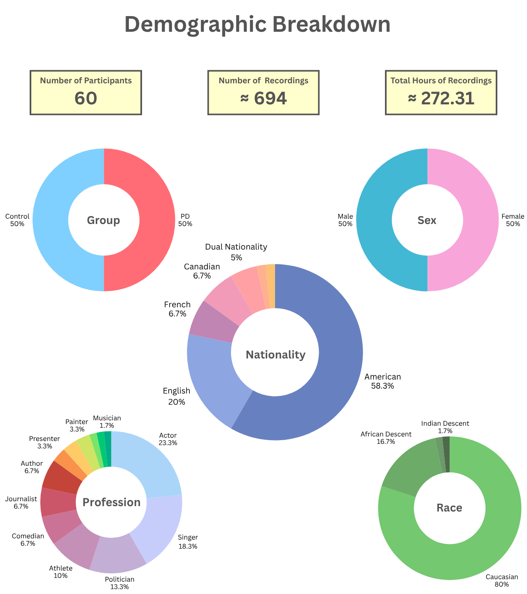

# Celebs4PD: A Longitudinal Corpus of Natural Celebrity Speech for Parkinson's Disease Detection

<table border="0" cellpadding="0" cellspacing="0" style="border: none;">
  <tr style="border: none;">
    <td style="border: none; vertical-align: middle; padding-right: 20px;">
      <strong>Celebs4PD</strong> is a curated corpus of celebrity speech designed for research on speech-based biomarkers of Parkinson's Disease (PD). The dataset provides natural, longitudinal recordings with demographic matching and standardized processing, enabling reproducible research in automatic PD detection and progression monitoring.
      <br><br>
        <span><strong>Languages:</strong></span>
      <span style="display: inline-block; background-color: #0366d6; color: white; padding: 4px 10px; border-radius: 3px; font-size: 12px; font-weight: 600; margin-right: 8px;">🇬🇧 English,</span>
      <span style="display: inline-block; background-color: #0366d6; color: white; padding: 4px 10px; border-radius: 3px; font-size: 12px; font-weight: 600;"> 🇫🇷 French</span>
    </td>
    <td style="border: none; vertical-align: middle;">
      
    </td>
  </tr>
</table>

---

## 📦 Access

The Celebs4PD metadata bundle is available through Zenodo under restricted access requiring a signed Data Use Agreement (DUA) for academic or non-commercial research purposes.

**Request access:** [doi.org/10.5281/zenodo.XXXXXXX](https://doi.org/10.5281/zenodo.XXXXXXX)

**Metadata bundle includes:**
- Subject-level demographics and diagnostic information
- Recording-level metadata (source URLs, dates, speaker IDs)
- Source mapping file for automated audio retrieval

**Generated locally via pipeline:**
- Audio files (retrieved from publicly available data)
- Segment-level annotations with 40+ speech metrics

> ⚠️ **Data Availability Note:**  
>
> The dataset was designed to include **700 recordings** across **60 participants**. Of these, **694 recordings (99.1%)** were successfully retrieved at the time of dataset creation, resulting in **272.31 hours** of audio data totaling approximately **177.9 GB** (after diarization).  
>  
> **Six recordings (0.9%)** were unavailable due to content removal, account or channel termination, regional access restrictions, copyright enforcement, or other platform-related policy changes.  
>  
> Such content loss is a common limitation when working with publicly available web media. Researchers should note that audio availability may fluctuate over time and that the accompanying metadata may reference recordings that are no longer accessible.
>
> **Note:** All duration and size statistics reflect the dataset state after mandatory diarization (target speaker extraction). The optional denoising step may further modify audio characteristics but does not affect the reported baseline metrics.

**Access procedure:**
1. Review and sign the Data Use Agreement on Zenodo
2. Submit signed DUA via email with subject line: **"Celebs4PD Data Use Agreement - [Your Name], [Your Institution]"** to nadine.el.mufti@gmail.com
3. Upon approval, receive access credentials for the metadata bundle

---

<p align="center">
  
</p>

> The Celebs4PD dataset contains **60 participants** contributing **694 recordings** with a total duration of **272.31 hours** of audio data, amounting to approximately **177.9 GB** of uncompressed material.

### Comprehensive Dataset Breakdown

| Category | Subcategory | Participants | Recordings | Duration (hrs) | Avg Length (min) | % of Total |
|----------|-------------|--------------|------------|----------------|------------------|------------|
| **Overall** | **Total** | **60** | **694** | **272.31** | **23.54** | **100%** |
| | | | | | | |
| **Diagnostic Group** | PD | 30 | 384 | 136.62 | 21.35 | 50.0% |
| | Control | 30 | 310 | 135.69 | 26.26 | 50.0% |
| | | | | | | |
| **Sex** | Female | 30 | 281 | 126.82 | 27.08 | 50.0% |
| | Male | 30 | 413 | 145.49 | 21.14 | 50.0% |
| | | | | | | |
| **Nationality** | American | 35 | 389 | 161.08 | 24.85 | 58.3% |
| | English | 12 | 118 | 49.66 | 25.25 | 20.0% |
| | French | 4 | 53 | 12.52 | 14.18 | 6.7% |
| | Canadian | 4 | 49 | 25.60 | 31.35 | 6.7% |
| | Dual Nationality | 3 | 72 | 17.77 | 14.79 | 5.0% |
| | Dominican | 1 | 5 | 3.51 | 42.16 | 1.7% |
| | Australian | 1 | 7 | 2.09 | 17.92 | 1.7% |
| | | | | | | |
| **Race/Ethnicity** | Caucasian | 48 | 564 | 219.05 | 23.30 | 80.0% |
| | African Descent | 10 | 112 | 44.10 | 23.63 | 16.7% |
| | Hispanic Descent | 1 | 5 | 3.51 | 42.16 | 1.7% |
| | Indian Descent | 1 | 14 | 5.64 | 26.03 | 1.7% |
| | | | | | | |
| **Profession** | Actor | 14 | 183 | 64.43 | 21.13 | 23.3% |
| | Singer | 11 | 151 | 43.31 | 17.21 | 18.3% |
| | Politician | 8 | 91 | 46.89 | 30.92 | 13.3% |
| | Athlete | 6 | 77 | 33.12 | 25.82 | 10.0% |
| | Comedian | 4 | 52 | 17.47 | 20.15 | 6.7% |
| | Journalist | 4 | 29 | 14.65 | 30.31 | 6.7% |
| | Author | 4 | 33 | 18.42 | 33.49 | 6.7% |
| | Presenter | 2 | 30 | 6.85 | 13.70 | 3.3% |
| | Astronaut | 2 | 14 | 9.74 | 41.72 | 3.3% |
| | Painter | 2 | 8 | 6.18 | 46.39 | 3.3% |
| | Fashion Designer | 1 | 12 | 2.61 | 13.03 | 1.7% |
| | Physician | 1 | 13 | 5.64 | 26.03 | 1.7% |
| | Musician | 1 | 2 | 2.91 | 87.30 | 1.7% |

---

## 🎯 Key Features

- **Natural speech** from public sources  
- **Longitudinal recordings** enabling temporal analysis  
- **Demographically matched pairs** across sex, age, and diagnostic groups  
- **Diverse participant pool** spanning 2 diagnostic groups, 2 sexes, 7 nationalities, 4 races, and 13 professions
- **Segmented into ≤ 20 s clips** for consistent acoustic analysis and metric extraction  
- **Standardized audio processing** via transparent, reproducible pipeline  
- **Comprehensive metadata** at subject, recording, and segment levels
- **GPU-accelerated processing** with automatic CUDA/MPS detection (CUDA: 10-20x speedup, MPS: 3-5x for diarization, CPU fallback for Whisper on MPS)
- **Flexible filtering** with JSON configuration for selective subject processing
- **Reproducible results** with fixed random seeds (1996) ensuring deterministic behavior

---

## 🎨 Data Curation

Celebs4PD was curated with careful demographic alignment to address critical limitations in existing PD speech datasets.

**Demographic matching:** Subject pairs are matched across sex, age, and diagnostic categories to control for confounding variables. Unlike unbalanced datasets that conflate disease effects with demographic differences, our matched design enables valid between-group comparisons.

**Longitudinal structure:** Multiple recordings per subject at different disease stages enable within-subject progression analysis. This temporal design is rare in PD speech corpora and allows investigation of biomarker evolution over time.

**Natural speech contexts:** Recordings capture spontaneous conversational speech from interviews, public addresses, and media appearances rather than controlled reading tasks, providing ecologically valid speech samples that reflect real-world communication.

**Standardized processing:** All recordings undergo identical processing (denoising, diarization, segmentation, annotation) with version-pinned dependencies to ensure reproducibility across different research groups.

---

## <a href="https://colab.research.google.com/drive/1pg1uhoNf_YLGz8XAzFz0aZv9Fr6ZW3VZ#scrollTo=vNalEY8LN1vT" target="_blank"></a> [Google Colab Demo](https://colab.research.google.com/drive/1pg1uhoNf_YLGz8XAzFz0aZv9Fr6ZW3VZ#scrollTo=vNalEY8LN1vT)

Try Celebs4PD with our step-by-step demo notebook - no local setup required!

### The notebook demonstrates:
- Downloading sample recordings from the dataset
- Running the complete processing pipeline (diarization, denoising, segmentation)
- Extracting speech features and generating transcriptions
- Processing recordings with GPU acceleration in Google Colab

Simply run each cell in sequence to process demo recordings and see the full Celebs4PD pipeline in action. Perfect for understanding the dataset structure and processing workflow before working with the full dataset locally.

---

## 🔑 Authentication

### Hugging Face Token

Required for pyannote diarization and overlap detection models.

1. Create account at [huggingface.co](https://huggingface.co)
2. Accept model conditions at [pyannote/speaker-diarization-3.1](https://huggingface.co/pyannote/speaker-diarization-3.1)
3. Generate READ token: Settings → Access Tokens → Create new token
4. Supply to scripts via `--hf-token <TOKEN>`

### YouTube Cookies (Optional)

Required for age-restricted or region-locked content.

**Option A: Export cookies to file**
1. Install Chrome extension [Get cookies.txt LOCALLY](https://chromewebstore.google.com/detail/get-cookiestxt-locally/cclelndahbckbenkjhflpdbgdldlbecc)
2. Visit YouTube (ensure logged in), export cookies to `cookies.txt`
3. Place in repository root
4. Use: `--cookies ./cookies.txt`

**Option B: Use browser cookies directly**
```bash
--cookies-from-browser "chrome:Default"
```

---

## ⚙️ Installation

The pipeline requires **Miniforge + mamba** with two isolated environments:

- `celebs4pd` → Main environment (download, denoise, diarization, segmentation, annotation)
- `spleeter` → Isolated environment for audio source separation

### Prerequisites

Request the **metadata bundle and directory skeleton from Zenodo** before installation. This provides the canonical subject folders and JSON metadata that the pipeline references.

### Platform-Specific Installation

#### `1. Install Miniforge`

- **macOS (Apple Silicon)**
```bash
curl -L https://github.com/conda-forge/miniforge/releases/latest/download/Miniforge3-MacOSX-arm64.sh -o miniforge.sh
bash miniforge.sh -b -p "$HOME/miniforge" -f
source "$HOME/miniforge/bin/activate"
```

- **macOS (Intel)**
```bash
curl -L https://github.com/conda-forge/miniforge/releases/latest/download/Miniforge3-MacOSX-x86_64.sh -o miniforge.sh
bash miniforge.sh -b -p "$HOME/miniforge" -f
source "$HOME/miniforge/bin/activate"
```

- **Linux**
```bash
curl -L https://github.com/conda-forge/miniforge/releases/latest/download/Miniforge3-Linux-x86_64.sh -o miniforge.sh
bash miniforge.sh -b -p "$HOME/miniforge" -f
source "$HOME/miniforge/bin/activate"
```

- **Windows**
> Download and execute [Miniforge3-Windows-x86_64.exe](https://conda-forge.org/miniforge/). During installation, select "Add Miniforge3 to my PATH environment variable". After installation, use Miniforge Prompt for all commands.

#### `2. Initialize mamba`

- **macOS (Apple Silicon)/Linux**
```bash
conda activate base
conda install -n base -c conda-forge -y mamba

# Detect and initialize for your current shell
CURRENT_SHELL=$(basename "$SHELL")
eval "$(mamba shell hook --shell $CURRENT_SHELL)"
mamba shell init --shell $CURRENT_SHELL --root-prefix="$HOME/miniforge"

# Restart your terminal or run:
exec $CURRENT_SHELL
```

- **Windows (Miniforge Prompt)**
```cmd
conda activate base
conda install -n base -c conda-forge -y mamba
mamba init
```

> **Note:** After initialization, close and reopen your terminal. The script auto-detects bash/zsh/fish. If you encounter issues, manually replace `$CURRENT_SHELL` with your shell name (e.g., `bash`, `zsh`).

#### `3. Create environments`

- **Main environment**
```bash
# Navigate to the Celebs4PD repository directory
cd Celebs4PD

mamba create -n celebs4pd -c conda-forge -y python=3.10 ffmpeg libsndfile
mamba activate celebs4pd

# Install the celebs4pd package (this automatically installs all dependencies)
pip install -e .

# Verify installation
pip check
```

> **Note:** `pip install -e .` installs the package in "editable" mode, meaning you can modify the source code and changes take effect immediately without reinstalling. This command reads `setup.py` and installs all dependencies listed in `install_requires`.

- **Download spaCy language models**
```bash
python -m spacy download en_core_web_sm --direct
python -m spacy download fr_core_news_sm --direct
```

- **Spleeter environment**
```bash
mamba create -n spleeter -c conda-forge -y python=3.8 pydub ffmpeg
mamba activate spleeter
pip install spleeter
mamba activate celebs4pd
```

---

## 🔧 Processing Pipeline

After installing the package with `pip install -e .`, run commands sequentially in the `celebs4pd` environment.

### Performance Overview

All scripts support GPU acceleration with automatic device detection:
- **CUDA (NVIDIA GPU)**: 10-20x faster than CPU for transcription, 5-10x for diarization/overlap detection
- **MPS (Apple Silicon)**: Whisper has compatibility issues - automatically falls back to CPU. For diarization/overlap detection: 3-5x faster than CPU
- **CPU**: Baseline speed (functional but slower)

**General optimization tips:**
- Increase batch sizes gradually to maximize GPU utilization (monitor VRAM usage)
- Match worker count to available CPU cores for feature extraction tasks
- Process multiple subjects in parallel using separate terminals with different filter configs

**Troubleshooting:**
- **GPU out-of-memory**: Reduce `--batch-size` to 1-2
- **Slow processing**: Verify GPU detection in console output at script startup
- **Interrupted processing**: Rerun with same filters; scripts skip completed files automatically via marker files (`.diarized`, `.denoised`) or existing segment folders

---

### 1. Download Recordings

Downloads audio from URLs in `source_mapping.json`.

**Process all recordings (optimal settings):**
```bash
celebs4pd-download-data \
  --mapping ./source_mapping.json \
  --out "./Celebs4PD Dataset" \
  --cookies ./cookies.txt \
  --retries 10 \
  --rate-limit "1M"
```

**Process specific subjects:**
```bash
celebs4pd-download-data \
  --mapping ./source_mapping.json \
  --out "./Celebs4PD Dataset" \
  --cookies ./cookies.txt \
  --filter-config ./filter_config.json \
  --retries 10
```

**Retry failed downloads:**
```bash
celebs4pd-download-data \
  --mapping ./results/retry_mapping.json \
  --out "./Celebs4PD Dataset" \
  --cookies ./cookies.txt \
  --retries 10
```

**Force reprocessing of already-downloaded files:**
```bash
celebs4pd-download-data \
  --mapping ./source_mapping.json \
  --out "./Celebs4PD Dataset" \
  --cookies ./cookies.txt \
  --force \
  --retries 10
```

> **Performance:** Network-bound. `--retries 10` handles transient failures. `--rate-limit "1M"` prevents throttling. Adjust rate limit lower for unstable connections (e.g., `"500K"`).

**Common download challenges:**
- **Content removal**: Videos deleted by uploaders or platforms (unrecoverable)
- **Account termination**: Channel suspensions or policy violations (unrecoverable)
- **Geo-restrictions**: Region-locked content (try `export YT_GEO=<COUNTRY_CODE>`)
- **Age-restricted content**: Requires authenticated cookies (use `--cookies` or `--cookies-from-browser`)
- **Platform policy changes**: Updated access restrictions or API limitations (may require manual intervention)

---

### 2. Denoise and Remove Overlaps

Removes background noise (Spleeter) and overlapped speech (pyannote). Modifies files in-place.

> **⚠️ WARNING:** This step modifies files IN-PLACE. Original recordings are permanently replaced. Back up your dataset before running if you need to preserve originals.

> **Prerequisites:** Ensure `mamba` is initialized and `spleeter` environment exists with Spleeter installed.

**Process all recordings (optimal settings):**
```bash
celebs4pd-denoise-and-remove-overlaps \
  --dataset-root "./Celebs4PD Dataset" \
  --hf-token <HF_TOKEN> \
  --workers 4
```

**Process specific subjects:**
```bash
celebs4pd-denoise-and-remove-overlaps \
  --dataset-root "./Celebs4PD Dataset" \
  --hf-token <HF_TOKEN> \
  --filter-config ./filter_config.json \
  --workers 4
```

**Force reprocessing of already-denoised files:**
```bash
celebs4pd-denoise-and-remove-overlaps \
  --dataset-root "./Celebs4PD Dataset" \
  --hf-token <HF_TOKEN> \
  --force \
  --workers 4
```

> **Performance:** ~1-2 min/recording. Spleeter (CPU-bound) runs via `mamba run`. Overlap detection accelerated by GPU (5-10x on CUDA, 3-5x on MPS). `--workers 4` enables parallel processing (adjust to match CPU cores, recommended: 4-8). Completed files tracked via `.denoised` marker files (created only when BOTH Spleeter AND overlap removal succeed).

---

### 3. Diarize and Extract Target Speaker

Extracts target speaker's voice. Originals automatically backed up in `Non-Diarized Recordings/`.

> **⚠️ WARNING:** This operation modifies your dataset structure. Original recordings are moved to "Non-Diarized Recordings" subdirectory and main recording files are replaced with extracted single-speaker audio.

**Process all recordings (optimal settings):**
```bash
celebs4pd-diarize \
  --dataset-root "./Celebs4PD Dataset" \
  --metadata-root "./Celebs4PD Metadata" \
  --hf-token <HF_TOKEN>
```

**Process specific subjects:**
```bash
celebs4pd-diarize \
  --dataset-root "./Celebs4PD Dataset" \
  --metadata-root "./Celebs4PD Metadata" \
  --hf-token <HF_TOKEN> \
  --filter-config ./filter_config.json
```

**Example `filter_config.json`:**
```json
{
  "pd_01": ["Pre-Diagnosis", "Post-Diagnosis"],
  "pd_02": ["Pre-Diagnosis"],
  "control_01": null,
  "control_02": null
}
```

**Force reprocessing of already-diarized files:**
```bash
celebs4pd-diarize \
  --dataset-root "./Celebs4PD Dataset" \
  --metadata-root "./Celebs4PD Metadata" \
  --hf-token <HF_TOKEN> \
  --force
```

> **Performance:** GPU provides 3-5x speedup (CUDA) or 2-3x (MPS). Speaker detection optimized via metadata "Speaker ID" field.

> **`--force` behavior:** When reprocessing with `--force`, the script intelligently uses the untouched original audio from `Non-Diarized Recordings/` if available (safest approach). If no backup exists, it uses the current file. This prevents data degradation from repeated diarization operations. Completed files tracked via `.diarized` marker files.

---

### 4. Segment and Annotate

Segments into 20s windows (5s overlap) and annotates with 40+ speech metrics.

> **⚠️ WARNING:** This script creates many new files (multiple segments per recording plus metadata JSON files). Ensure adequate disk space is available. Segments are permanent additions to your dataset.

**Process all recordings (optimal settings):**
```bash
celebs4pd-segment-and-annotate \
  --dataset-root "./Celebs4PD Dataset" \
  --metadata-root "./Celebs4PD Metadata" \
  --whisper-model "small" \
  --batch-size 8 \
  --num-workers 8
```

**Process specific subjects:**
```bash
celebs4pd-segment-and-annotate \
  --dataset-root "./Celebs4PD Dataset" \
  --metadata-root "./Celebs4PD Metadata" \
  --whisper-model "small" \
  --batch-size 8 \
  --num-workers 8 \
  --filter-config ./filter_config.json
```

**Force reprocessing of already-segmented-and-annotated files:**
```bash
celebs4pd-segment-and-annotate \
  --dataset-root "./Celebs4PD Dataset" \
  --metadata-root "./Celebs4PD Metadata" \
  --force \
  --whisper-model "small" \
  --batch-size 8 \
  --num-workers 8
```

> **Performance:** GPU dramatically accelerates Whisper transcription on CUDA (10-20x). Note: MPS has known Whisper compatibility issues - script automatically falls back to CPU for stability. Feature extraction is CPU-bound (parallelized via `--num-workers`). `--whisper-model "small"` provides best balance of accuracy/speed. `--batch-size 8` optimizes GPU utilization (reduce to 4 or 2 if VRAM limited). `--num-workers 8` parallelizes feature extraction (adjust to match CPU cores). Note: Whisper doesn't support true batch inference, so segments are processed sequentially.

> **`--force` behavior:** By default, recordings with existing `recording_N/` segment folders are skipped. Use `--force` to reprocess and replace existing segments. The script intelligently checks for existing segments before processing.

---

### 5. Generate Statistics (Optional)

Export dataset statistics to CSV files.

```bash
celebs4pd-stats \
  --metadata-root "./Celebs4PD Metadata" \
  --dataset-root "./Celebs4PD Dataset" \
  --demographics "./metadata JSON helpers/demographics.json" \
  --output-dir "./stats_csv"
```

> **Note:** `--dataset-root` is optional. Without it, duration statistics will be zero. Install `soundfile` library for duration calculations: `pip install soundfile`

**Outputs:** 7 CSV files in `./stats_csv/` with demographic and recording statistics.

---

## 🔍 Filtering Configuration

All processing scripts support JSON configuration files for selective subject processing.

### Configuration Format

```json
{
  "subject_id": stage_list_or_null
}
```

**Rules:**
- `null`: Process all recordings for subject
- `["Stage"]`: Process only specified stage(s)
- Omitted subjects: Not processed
- Control subjects: Always use `null` (no stage directories)

### Example Configurations

**Single subject (all recordings):**
```json
{
  "pd_01": null
}
```

**Single subject (single stage):**
```json
{
  "pd_01": ["Pre-Diagnosis"]
}
```

**Multiple subjects (mixed):**
```json
{
  "pd_01": ["Pre-Diagnosis", "Post-Diagnosis"],
  "pd_02": ["Pre-Diagnosis"],
  "control_01": null,
  "control_02": null
}
```

**Longitudinal study (pre-diagnosis baseline):**
```json
{
  "pd_01": ["Pre-Diagnosis"],
  "pd_02": ["Pre-Diagnosis"],
  "pd_03": ["Pre-Diagnosis"],
  "control_01": null,
  "control_02": null
}
```

---

## 📤 Output Format

After pipeline completion, each segment contains:

**Audio:** `recording_N_segment_k.wav` (cleaned, single-speaker, where k ∈ {0, 1, 2, ...})

**Metadata:** `recording_N_segment_k_metadata.json` with:
- Subject-level metadata
- Recording-level metadata
- Segment-level metadata: full transcript + 40+ speech metrics
  - Temporal features (speaking rate, pauses, articulation)
  - Linguistic features (TTR, function word ratio, POS distribution)
  - Syllable features (syllables per second, mean syllables per word)
  - Acoustic features (pitch, jitter, shimmer, HNR, intensity)
  - Complexity features (Flesch Reading Ease, Flesch-Kincaid Grade, Gunning Fog)

---

## 📁 Dataset Structure

🟦 = Retrieved from Zenodo  
🟨 = Generated locally by pipeline  
🟥 = User-supplied files  

```
Celebs4PD/
│
├── README.md
│
├── CHANGELOG.md
│
├── setup.py
│
├── requirements.txt
│
├── .gitignore
│
├── celebs4pd/
│   ├── __init__.py
│   ├── utils/
│   │   ├── __init__.py
│   │   └── filtering.py
│   └── scripts/
│       ├── __init__.py
│       ├── download_recordings_from_metadata.py
│       ├── denoise_and_remove_overlaps.py
│       ├── diarize_and_extract_target_speaker.py
│       ├── segment_and_annotate_recordings.py
│       └── export_statistics_to_csv.py
│
├── logo/
│   ├── Celebs4PD - Large.gif
│   ├── Celebs4PD - Medium.gif
│   └── Celebs4PD - Small.gif
│
├── stats_csv/                        # 🟨 generated locally
│   ├── by_diagnostic_group.csv
│   ├── by_nationality.csv
│   ├── by_profession.csv
│   ├── by_race.csv
│   ├── by_sex.csv
│   ├── group_by_sex_crosstab.csv
│   └── overall_statistics.csv
│
├── stats_img/
│   └── demographics.png
│
├── source_mapping.json                # 🟦 from Zenodo
│
├── cookies.txt                        # 🟥 optional (but recommended)
│
├── filter_config.json                 # 🟥 optional
│
├── metadata JSON helpers/           
│   └── demographics.json
│
├── Celebs4PD Metadata/                # 🟦 from Zenodo
│   ├── Male Control/
│   │   ├── control_01/
│   │   │   ├── control_01_metadata.json
│   │   │   ├── recording_1/
│   │   │   │   ├── control_01_recording_1_metadata.json
│   │   │   │   ├── control_01_recording_1_segment_0_metadata.json
│   │   │   │   ├── control_01_recording_1_segment_1_metadata.json
│   │   │   │   └── ...
│   │   │   ├── recording_2/
│   │   │   └── ...
│   │   ├── control_02/
│   │   └── ...
│   │
│   ├── Female Control/
│   │   ├── control_XX/
│   │   └── ...
│   │
│   ├── Male with PD/
│   │   ├── pd_01/
│   │   │   ├── pd_01_metadata.json
│   │   │   ├── Pre-Diagnosis/
│   │   │   │   ├── recording_1/
│   │   │   │   │   ├── pd_01_pre_diagnosis_recording_1_metadata.json
│   │   │   │   │   ├── pd_01_pre_diagnosis_recording_1_segment_0_metadata.json
│   │   │   │   │   ├── pd_01_pre_diagnosis_recording_1_segment_1_metadata.json
│   │   │   │   │   └── ...
│   │   │   │   ├── recording_2/
│   │   │   │   └── ...
│   │   │   └── Post-Diagnosis/
│   │   │       ├── recording_1/
│   │   │       └── ...
│   │   ├── pd_02/
│   │   └── ...
│   │
│   └── Female with PD/
│       ├── pd_XX/
│       └── ...
│
├── Celebs4PD Dataset/                 # 🟨 generated locally
│   ├── Male Control/
│   │   ├── control_01/
│   │   │   ├── recording_1.wav
│   │   │   ├── recording_1.wav.diarized
│   │   │   ├── recording_1.wav.denoised
│   │   │   ├── Non-Diarized Recordings/
│   │   │   │   └── recording_1.wav
│   │   │   ├── recording_1/
│   │   │   │   ├── recording_1_segment_0.wav
│   │   │   │   ├── recording_1_segment_1.wav
│   │   │   │   └── ...
│   │   │   ├── recording_2.wav
│   │   │   ├── recording_2/
│   │   │   └── ...
│   │   ├── control_02/
│   │   └── ...
│   │
│   ├── Female Control/
│   │   └── ...
│   │
│   ├── Male with PD/
│   │   ├── pd_01/
│   │   │   ├── Pre-Diagnosis/
│   │   │   │   ├── recording_1.wav
│   │   │   │   ├── recording_1.wav.diarized
│   │   │   │   ├── recording_1.wav.denoised
│   │   │   │   ├── Non-Diarized Recordings/
│   │   │   │   │   └── recording_1.wav
│   │   │   │   ├── recording_1/
│   │   │   │   │   ├── recording_1_segment_0.wav
│   │   │   │   │   ├── recording_1_segment_1.wav
│   │   │   │   │   └── ...
│   │   │   │   ├── recording_2.wav
│   │   │   │   ├── recording_2/
│   │   │   │   └── ...
│   │   │   └── Post-Diagnosis/
│   │   │       ├── recording_1.wav
│   │   │       ├── recording_1/
│   │   │       └── ...
│   │   ├── pd_02/
│   │   └── ...
│   │
│   └── Female with PD/
│       └── ...
│
└── results/                           # 🟨 generated locally
    └── retry_mapping.json             # Failed downloads
```

---

## 📊 Audio Specifications

Audio files are preserved in their original quality as retrieved from source platforms:
 
| Property | Value |
|----------|-------|
| **Sample Rate** | 44100 Hz (44.1 kHz) |
| **Channels** | 2 (Stereo) |
| **Bit Depth** | 16-bit PCM |
| **Format** | WAV (Microsoft) |
| **Total Dataset Size** | [TO BE DETERMINED] |

> **Note:** The pipeline preserves original audio quality without resampling or format conversion. Researchers can apply domain-specific preprocessing during model training according to their experimental requirements.

---

## 🔄 Reproducibility

All dependencies in `requirements.txt` are pinned to exact versions to ensure deterministic behavior across installations. The pipeline uses frozen model versions to guarantee reproducible results.

**Critical Dependencies:**
* `pyannote.audio==3.3.2`
* `pyannote.core==5.0.0`
* `torch==2.2.2`
* `openai-whisper==20231117`
* Random seeds fixed to **1996** for all model inference

**Reproducibility Notes:**
- Minor numerical differences may occur in Spleeter (TensorFlow) or Whisper (Torch) due to backend or GPU nondeterminism
- These do **not** affect dataset structure or metadata consistency
- GPU acceleration (CUDA/MPS) provides 5-10x speedup while maintaining deterministic results

---

## 📚 Citation

If you use Celebs4PD in academic work, please cite:

> El-Mufti, Nadine. (2025). Celebs4PD: A Longitudinal Corpus of Natural Celebrity Speech for Parkinson's Disease Detection (Version 1.0) [Dataset]. Zenodo. https://doi.org/10.5281/zenodo.XXXXXXX

BibTeX entry will be provided upon dataset DOI release.

---

## 🤝 Contributing

Contributions are welcome. Please open an issue or submit a pull request with improvements.

---

## ⚖️ License

### Dataset & Metadata
The **Celebs4PD metadata bundle** (subject demographics, recording metadata, segment annotations) is distributed for **academic and non-commercial research use only** under a **Data Use Agreement (DUA)**.

- **Access requirement** – Use requires signed DUA approved by dataset curator
- **Permitted uses** – Research, academic study, reproducible analysis
- **Prohibited uses** – Commercial applications, redistribution, public re-hosting
- **Attribution** – All publications must cite the dataset

### Audio Files
Original audio recordings are **not included** in the distributed dataset. Audio is downloaded from publicly available sources (YouTube, etc.) using the provided pipeline. Users are responsible for complying with the terms of service of source platforms.

### Processing Pipeline (Code)
The processing scripts and pipeline code in this repository are provided for reproducibility and may be used in accordance with the DUA terms.

### How to Request Access

1. Review the Celebs4PD Data Use Agreement on Zenodo
2. Sign and submit DUA to **nadine.el.mufti@gmail.com** with subject line:  
   **"Celebs4PD Data Use Agreement - [Your Name], [Your Institution]"**
3. Upon approval, receive credentials to download metadata bundle from Zenodo

> © 2025 Nadine El-Mufti et al. All rights reserved.  
> Use governed by Celebs4PD Data Use Agreement (DUA).  
> Redistribution or commercial use prohibited.

---

## 📧 Contact

**Nadine El-Mufti** (Dataset Curator & Maintainer)  
📧 nadine.el.mufti@gmail.com  
📱 [LinkedIn](https://www.linkedin.com/in/nadine-el-mufti/)  
🆔 [ORCID: 0009-0004-3869-8771](https://orcid.org/0009-0004-3869-8771)  

**Dr. Miro Ravanelli** (Supervisor)  
📧 mirco.ravanelli@gmail.com  
📱 [LinkedIn](https://www.linkedin.com/in/mirco-ravanelli-489b692a)  
🆔 [ORCID: 0000-0002-3929-5526](https://orcid.org/0000-0002-3929-5526)  

**Dr. Marta Kersten-Oertel** (Co-Supervisor)  
📧 marta.kersten@gmail.com  
📱 [LinkedIn](https://www.linkedin.com/in/marta-kersten-oertel-6b1a742/)  
🆔 [ORCID: 0000-0002-9492-8402](https://orcid.org/0000-0002-9492-8402)
